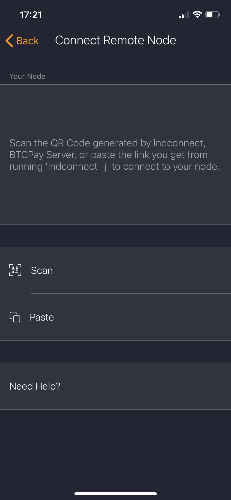
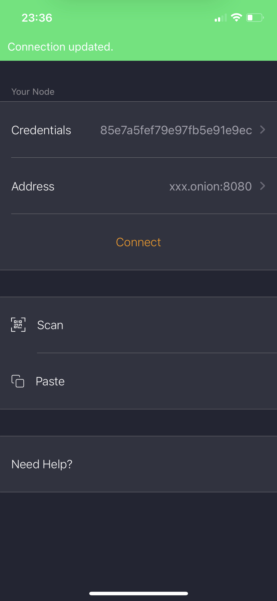

# Zap


Tijd: 5 minuten


Zap is een Lightning wallet [app voor iOS](https://apps.apple.com/nl/app/zap-bitcoin-lightning-wallet/id1406311960). De app is uiterst gebruiksvriendelijk en daarom iedereen aan te raden. En het mooiste is: je kunt hem aan je eigen node hangen via Tor.

Als je de app installeert en voor het eerst opent, wordt je gevraagd een PIN te bedenken. Direct daarna verschijnt een scherm waarmee jij jouw node kunt connecten. Hiervoor moet je [lndconnect](https://docs.theroadtonode.com/lightning-extensies/lnd-connect) installeren op je Pi. SSH je Pi in en typ:

```bash
lndconnect --host=xxx.onion --port=8080 --nocert -j
```

Waar **xxx.onion** staat, vul je natuurlijk [jouw onion-adres](https://docs.theroadtonode.com/lightning/tor-aanpassen#onion-adressen) in voor de **REST** API van LND. Er zal een lap tekst verschijnen dat iets weg heeft van het volgende.

```bash
lndconnect://xxx.onion:8080?macaroon=heel_veel_tekens
```

Kopieer die lap tekst en open de Zap app op je iPhone. Als het goed is zie je een scherm voor je dat lijkt op dit.



Klik op "Paste" en Zap vult alles automatisch voor je in.



Druk op "Connect" en de connectie komt tot stand.

## Connectie over clearnet

Je hoeft niet te verbinden via tor. Sterker nog, Zap werkt beter via clearnet. Je kunt op dezelfde manier een lndconnect string genereren als met tor.

```bash
lndconnect -j --host=JOUW_IP --port=10009 --adminmacaroonpath=~/.lnd/data/chain/bitcoin/mainnet/admin.macaroon --tlscertpath=~/.lnd/tls.cert
```

Je moet in het bovenstaande commando even `JOUW_IP` vervangen voor het IP van je Pi. Of als je een DDNS gebruikt vervangen met je URL.

