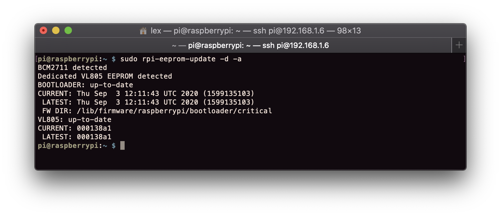
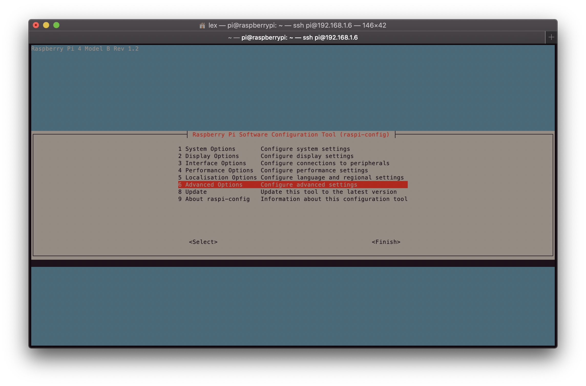
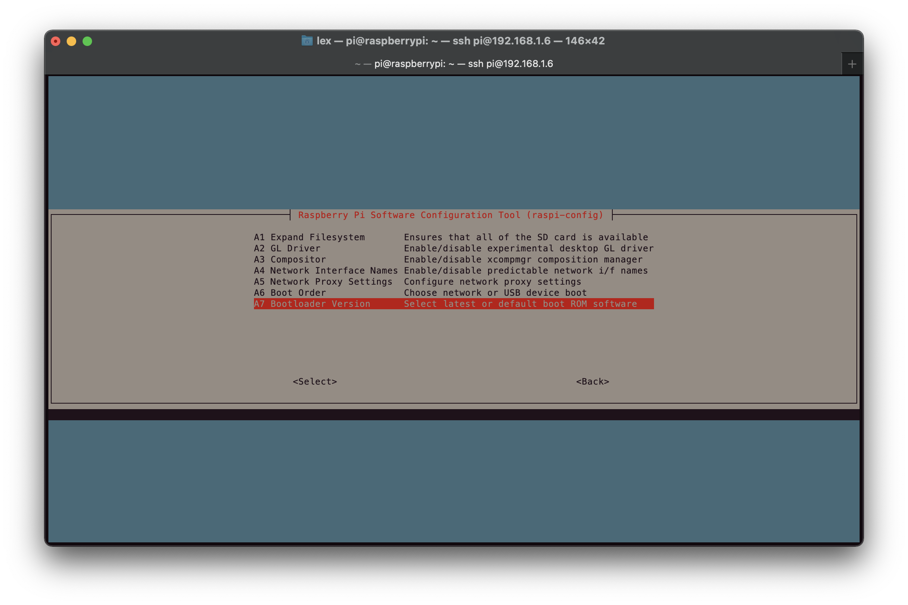
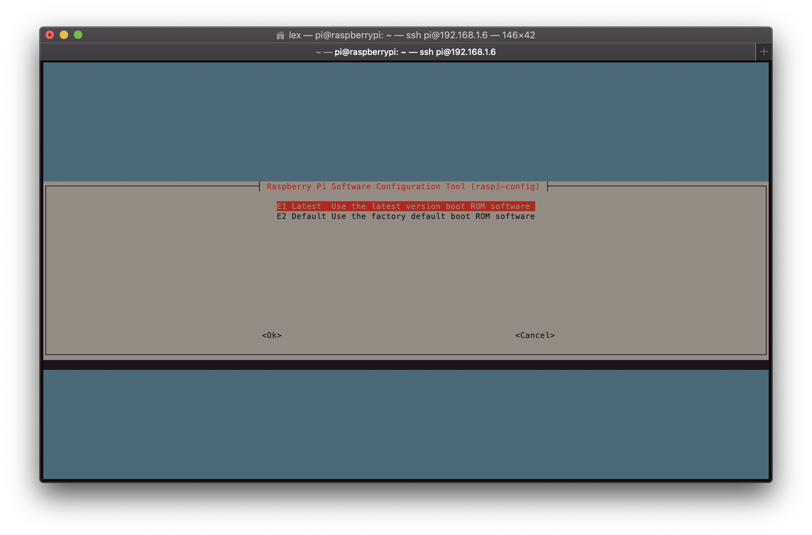
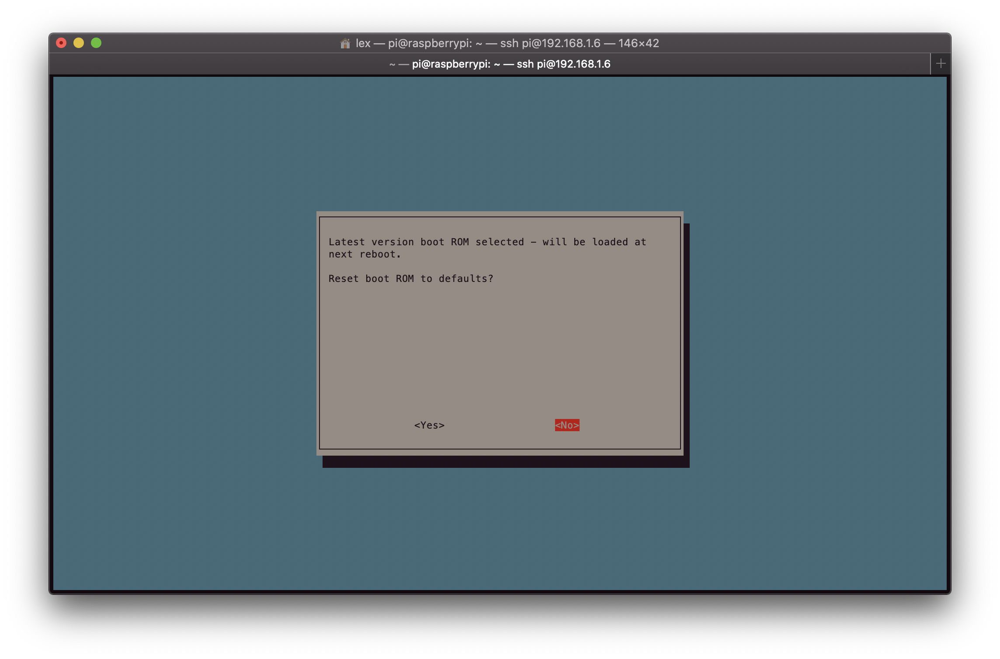
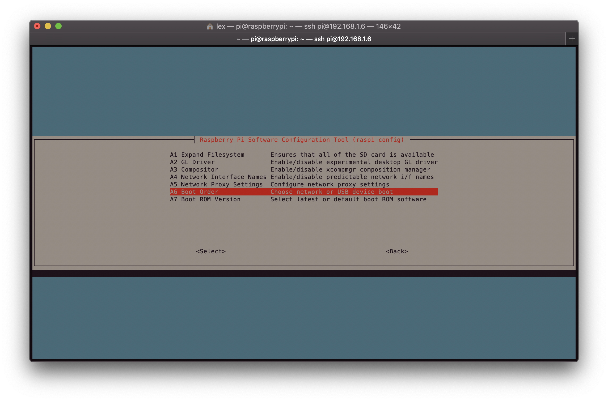
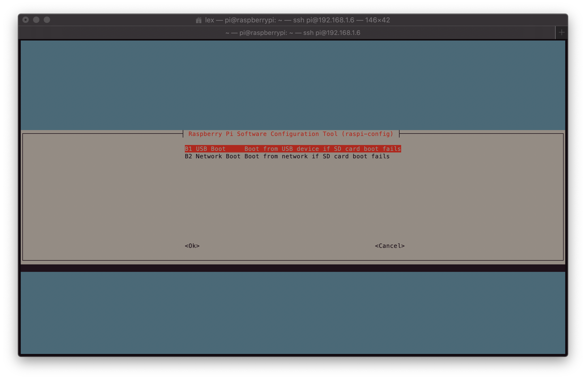
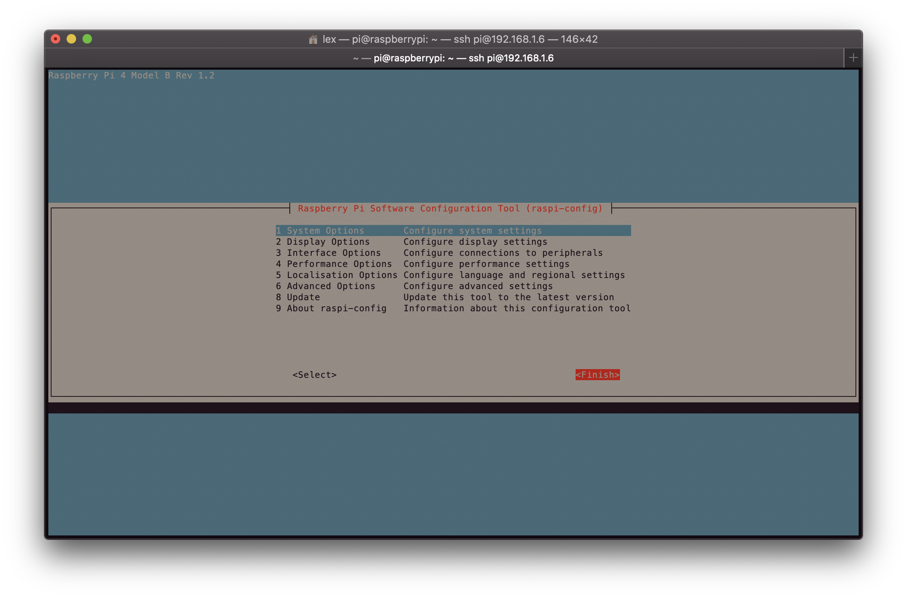
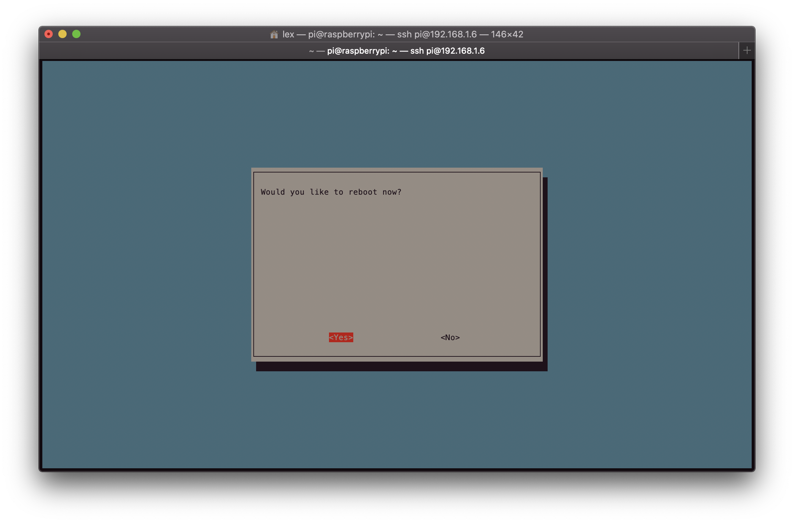
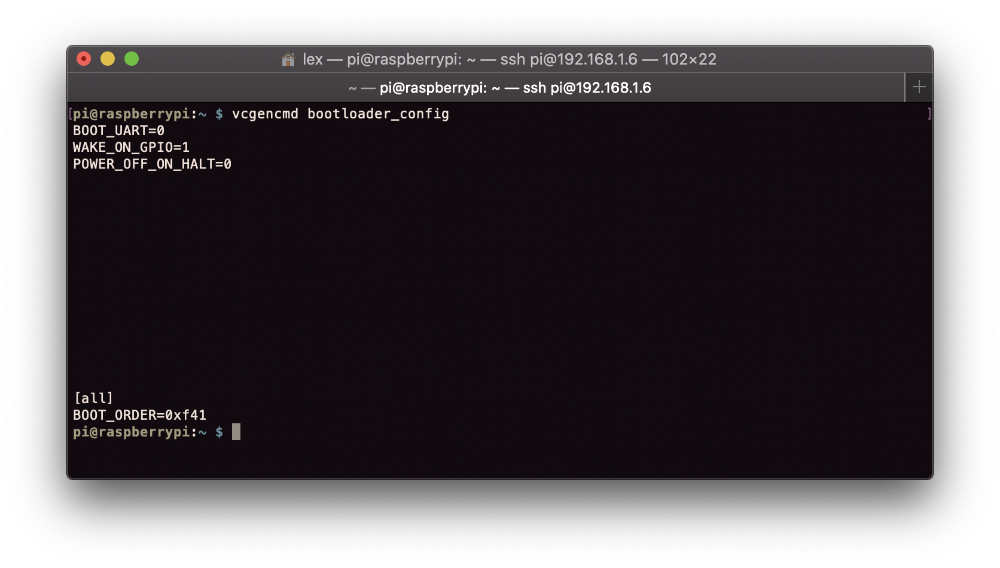

# Boot vanaf SSD


Tijd: 15 minuten


Sinds september 2020 is het officieel mogelijk om je Pi van een SSD op te starten in plaats van de microSD. Opstarten op deze manier geeft [betere performance](https://www.tomshardware.com/news/raspberry-pi-4-ssd-test,39811.html). Daarnaast omzeil je hiermee het gedoe van het mounten en tegen ieder stukje software zeggen dat die van de SSD gebruik moet maken. Aangezien we de SSD toch al hebben, waarom zouden we het dan niet doen?

Steek de microSD en netwerkkabel in de Pi waarna je de stroom aansluit. Na ongeveer een minuutje zal de Pi opgestart zijn en een IP-adres krijgen van je router. Log in op je router, want dit IP-adres heb je nodig. De meeste routers kun je in door naar 192.168.1.1 te gaan in je browser, maar hoe jouw netwerk is ingericht weet je zelf het best.

## SSH

[Secure Shell](https://nl.wikipedia.org/wiki/Secure_Shell) is een protocol om op een versleutelde manier in te loggen op een andere computer, en op afstand commando's op de andere computer uit te voeren via een terminal. Middels dit protocol is het mogelijk om vanaf onze computer de Pi aan te sturen.

Open een terminal en typ:

```bash
ssh pi@IP-ADRES VAN PI
```

Vervang in het commando `IP-ADRES VAN PI` met iets als `192.168.1.6`. Zodra je op enter drukt zal je een vraag krijgen waar je `YES/NO` op kunt antwoorden. Typ `yes` en druk op enter. Je krijgt nu de vraag een wachtwoord in te voeren. Het standaard wachtwoord is `raspberry`.

Wat hebben we nu net gedaan? Je hebt met het commando aangegeven dat je van SSH gebruik wil maken. Vervolgens specificeer je een gebruikersnaam en een computer. De computer is bereikbaar via een IP-adres.

## Update

Voer de volgende commando's uit:

```bash
sudo apt update
```

```bash
sudo apt full-upgrade -y
```

```bash
sudo rpi-update
```

```bash
sudo reboot now
```

Je Pi zal nu opnieuw opstarten waarna je opnieuw erin moet SSH'en.

## Boot configuratie

Voer de volgende commando's uit:

```bash
sudo rpi-eeprom-update -d -a
```



Als het goed is staat er dat de `BOOTLOADER` up-to-date is en zijn de waardes achter `CURRENT` en `LATEST` gelijk aan elkaar.

Het is tijd om de Pi op zo'n manier te configureren, dat we kunnen opstarten van de SSD.

```bash
sudo raspi-config
```

Er toont zich een scherm waardoor het lijkt alsof je in de jaren '80 beland bent. Kies `6 Advanced Options`.



Kies `A7 Bootloader Version`.



Kies `E1 Latest`.



Kies `No` en druk op`Ok`.



Kies nog een keer voor `6 Advanced Options`, maar ga dit maal voor `A6 Boot Order`.



Kies `B1 USB Boot` en druk op `Ok`.



Kies voor `Finish` om de instellingen af te ronden.



En tot slot `Yes` om opnieuw op te starten.



## Dubbelcheck

Om te controleren of alles goed is gegaan moet je weer de Pi in SSH'en. Voer het volgende uit.

```bash
vcgencmd bootloader_config
```

Op de onderste regel moet staan **BOOT\_ORDER=0xf41**. Als er **BOOT\_ORDER=0x0** staat, heb je iets fout gedaan.



Sluit je Pi af met:

```bash
sudo shutdown now
```

## Booten

Nu we de bootloader correct hebben ingesteld, kunnen we van de SSD booten. Haal de microSD uit de Pi en sluit de SSD aan. Zet de stroom erop et voilà! Het zou voor kunnen komen dat je de volgende foutmelding krijgt zodra opnieuw probeert te SSH'en naar je Pi:

```bash
@@@@@@@@@@@@@@@@@@@@@@@@@@@@@@@@@@@@@@@@@@@@@@@@@@@@@@@@@@@
@    WARNING: REMOTE HOST IDENTIFICATION HAS CHANGED!     @
@@@@@@@@@@@@@@@@@@@@@@@@@@@@@@@@@@@@@@@@@@@@@@@@@@@@@@@@@@@
IT IS POSSIBLE THAT SOMEONE IS DOING SOMETHING NASTY!
Someone could be eavesdropping on you right now (man-in-the-middle attack)!
It is also possible that a host key has just been changed.
The fingerprint for the ECDSA key sent by the remote host is
SHA256:xxxxxxxxxxxxxxxxxxxxxxxxxxxxxxx.
Please contact your system administrator.
Add correct host key in /Users/lex/.ssh/known_hosts to get rid of this message.
Offending ECDSA key in /Users/lex/.ssh/known_hosts:56
ECDSA host key for 192.168.1.6 has changed and you have requested strict checking.
Host key verification failed.
```

Zoiets van gemakkelijk op te lossen door op je computer het commando `nano .ssh/known_hosts` in te voeren. In het scherm dat volgt staan bekende computers voor jouw computer. Verwijder de regel met het IP-adres van jouw Pi. Sla het bestand op met `Ctrl + X` en bevestig met `Y`. Je hebt nu tegen jouw computer gezegd dat hij de eerdere relatie met de Pi mag vergeten en een nieuwe relatie mag opbouwen.

